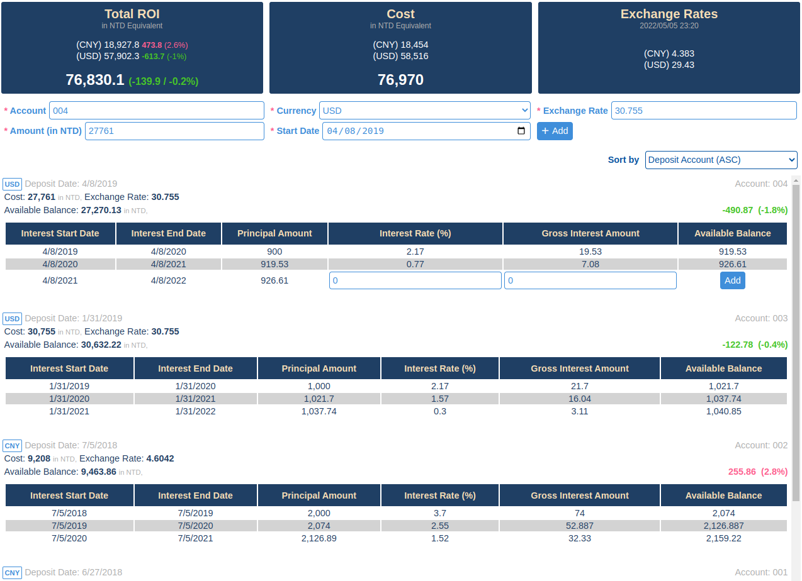
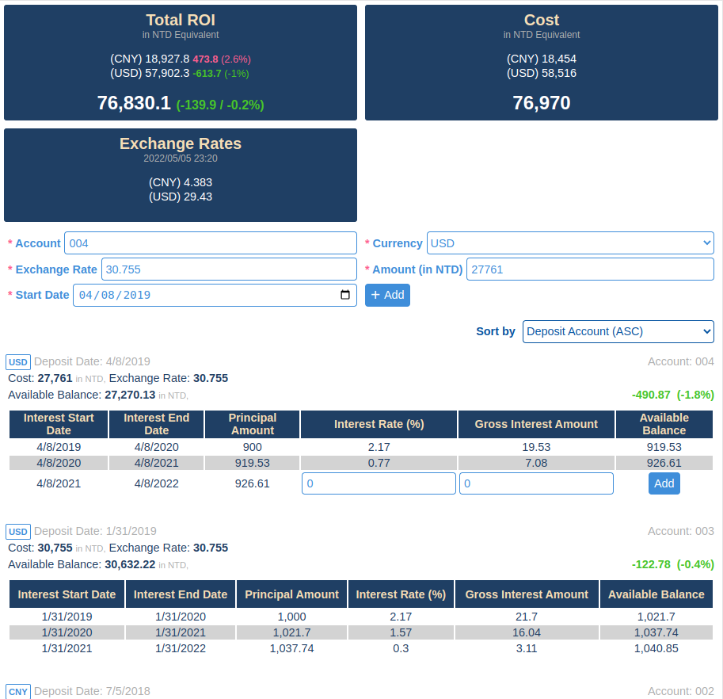
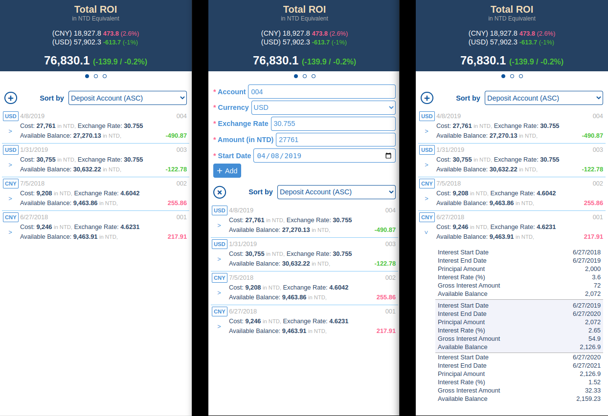

# Foreign Currency Time Deposit
A responsive and progressive web app built on top of Web Components.

## Technologies

### Frontend
- [Lit](https://lit.dev/)

### Backend
- [Firebase](https://firebase.google.com/)

## Prerequisite
1. Log into Google account and go to [Firebase console](https://console.firebase.google.com/), and then **Add project**.
2. Say we've added a new `time-deposit-demo` project, then let's move on to the [Firestore Database](https://console.firebase.google.com/project/time-deposit-demo/firestore) to **Create database**.
3. Navigate to [Project Overview](https://console.firebase.google.com/project/time-deposit-demo/overview), click the web(</>) icon to **Add an app to get started**. After the **Register app** step, we should get the `firebaseConfig` like this:
```js
const firebaseConfig = {
  apiKey: "...",
  authDomain: "...",
  projectId: "...",
  storageBucket: "...",
  messagingSenderId: "...",
  appId: "..."
};
```
Keep it for a later use.

## Get started
1. Clone the project to local environment and change working directory:
```sh
git clone https://github.com/chejen/time-deposit
cd time-deposit
```
2. Create an empty `.env` file.
3. Convert previously saved `firebaseConfig` from JS object to JSON string by using `JSON.stringify()`, and then paste the result into the `.env` file.
```properties
TIME_DEPOSIT_FIREBASE_CONFIG={"apiKey":"...","authDomain":"...","projectId":"...","storageBucket":"...","messagingSenderId":"...","appId":"..."}
```
4. Install dependencies and start the server.
```sh
yarn
yarn dev
```
5. Navigate to http://localhost:8080


## Optional environment variables
### TIME_DEPOSIT_COLLECTION_ID
The Firestore collection of this app is `time-deposit` by default. You can override this by setting `TIME_DEPOSIT_COLLECTION_ID`:
```properties
TIME_DEPOSIT_COLLECTION_ID=custom-collection-id
```

### TIME_DEPOSIT_AUTH
If you'd like, you can enable password-based log-in and authenticate with Firebase
1. In the Firebase console > **Authentication** section > [**Sign-in method**](https://console.firebase.google.com/project/time-deposit-demo/authentication/providers) tab, choose **Email/Password** sign-in method to enable it.
2. In the Firebase console > **Authentication** section > [**Users**](https://console.firebase.google.com/project/time-deposit-demo/authentication/users) tab, add an user with Email and Password.

3. Update Firestore [**Rules**](https://console.firebase.google.com/project/automatic-time-deposit/firestore/rules):
```
match /databases/{database}/documents {
  match /{document=**} {
    allow read, write: if
        request.auth.token.email == 'your-email-address@foo.bar';
  }
}
```

4. Enable the `TIME_DEPOSIT_AUTH` environment variable with the `email` value:
```properties
TIME_DEPOSIT_AUTH=email
```

## Demo
### On desktop


### On tablet


### On phone

